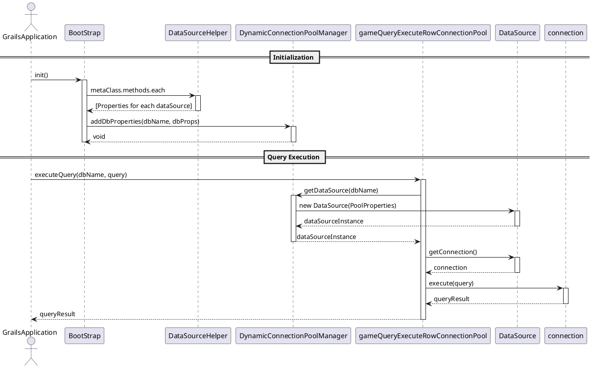

```plantuml
participant BootStrap
participant DataSourceHelper
participant DynamicConnectionPoolManager
== Initialization ==
GrailsApplication -> BootStrap: init()
activate BootStrap
BootStrap -> DataSourceHelper: metaClass.methods.each
activate DataSourceHelper
DataSourceHelper --> BootStrap: [Properties for each dataSource]
deactivate DataSourceHelper
BootStrap -> DynamicConnectionPoolManager: addDbProperties(dbName, dbProps)
activate DynamicConnectionPoolManager
DynamicConnectionPoolManager --> BootStrap: void
deactivate DynamicConnectionPoolManager
deactivate BootStrap
```

![[Pasted image 20240125112108.png]]


```plantuml
actor GrailsApplication
participant BootStrap
participant DataSourceHelper
participant DynamicConnectionPoolManager
participant CommonGameService
participant DataSource
== Query Execution ==
GrailsApplication -> CommonGameService: executeQuery(dbName, query)
activate gameQueryExecuteRowConnectionPool
CommonGameService -> DynamicConnectionPoolManager: getDataSource(dbName)
activate DynamicConnectionPoolManager
DynamicConnectionPoolManager -> DataSource: new DataSource(PoolProperties)
activate DataSource
DataSource --> DynamicConnectionPoolManager: dataSourceInstance
deactivate DataSource
DynamicConnectionPoolManager --> CommonGameService: dataSourceInstance
deactivate DynamicConnectionPoolManager
CommonGameService -> DataSource: getConnection()
activate DataSource
DataSource --> CommonGameService: connection
deactivate DataSource
CommonGameService -> connection: execute(query)
activate connection
connection --> CommonGameService: queryResult
deactivate connection
CommonGameService --> GrailsApplication: queryResult
deactivate CommonGameService
```

TwelveSky2OriginService.groovy
```groovy
String query = String.format(  
"DECLARE @result int exec @result = %s..SP_CountGiftItemSlot '%s' SELECT @result as result"  
,"ACCOUNT2"  
,user.username  
)  
String dataSourceName = 'dataSource_12sky2ori'  
String logPath = 'gameItemSendLog/12sky2OriSlotCheck'  
def result2 = commonGameService.gameQueryExecuteRowConnectionPool(dataSourceName,query, logPath)
```

CommonGameService.groovy
gameQueryExecuteRowConnectionPool
```groovy
def gameQueryExecuteRowConnectionPool(String dataSourceName, String query, String logPath){
        Connection conn = null
        Sql sql = null
        def map = [:]
        try{
            DataSource dataSource = null
//            String dataSourceName = dbInfo.get("dataSourceName").toString() //dataSource_audition
            if(dataSourceName) {
                dataSource = DynamicConnectionPoolManager.getDataSource(dataSourceName)
            }else{
                return map.put('Return',false)
            }
            conn = dataSource.getConnection()
            sql = new Sql(conn)
            if(conn) {
                sql.eachRow(query,
                        {
                            it.getProperties().metaData.each{ obj -> map.put(obj.columnName, it.getAt(obj.columnName))  }
                        }
                )
                if(logPath){
                    String logString = "query: $query, queryResult: $map.toString()"
                    Logger.log3(logString,logPath)
                }
            }
        }catch(Exception e){
            map.put('Return', false)
            String errMsg = e.printStackTrace()
            if(logPath){
                String logString = "query: $query, errMsg: $errMsg"
                Logger.log3(logString,logPath)
            }
        }finally{
            sql?.close()
            conn?.close()
        }
        return map
    }
```


DynamicConnectionPoolManager.groovy
```groovy
    static DataSource getDataSource(String dataSourceName) {
        /*
         dataSource Map 에 db이름에 맞는 datasource 가 있는지 없는지
         또는 dataSource Map 에서 DB 이름에 맞는 dataSource 가 null 로 들어가 있지 않은지
         create 하다가 터지면 dataSource Map 에 null 로 들어감
        */
        if (!dataSources.containsKey(dataSourceName) || dataSources.get(dataSourceName) == null) {
            Properties dbProps = dbPropertiesMap.get(dataSourceName)
            if (dbProps != null) {
                try {
                    DataSource dataSource = createDataSource(dbProps)
                    dataSources.put(dataSourceName, dataSource)
                } catch (Exception e) {
                    dataSources.put(dataSourceName, null) // 실패 시 null로 설정
                    throw new RuntimeException("Failed to create DataSource for $dataSourceName: ${e.message}", e)
                }
            } else {
                throw new IllegalStateException("No database properties found for: $dataSourceName")
            }
        }else {
            // 이미 생성된 DataSource에 대한 유효성 검사
            Properties dbProps = dbPropertiesMap.get(dataSourceName)
            DataSource dataSource = dataSources.get(dataSourceName)
            String dbType = dbProps.get("dbType").toString()
            /*
            Connection 이 있다가 네트워크 문제로 끊겼다가 재연결 될때 Exception 이 나옴.
            create 하다가 터졌을 때 dataSource Map 에서 삭제
            valid 통과 시에는 그냥 넘김
             */
            if (!isConnectionValid(dataSource,dbType)) {
                // 유효하지 않은 경우, DataSource 재생성
                try {
                    dataSource = createDataSource(dbProps)
                    dataSources.put(dataSourceName, dataSource)
                } catch (Exception e) {
                    dataSources.remove(dataSourceName) // 실패 시 DataSource 제거
                    throw new RuntimeException("Failed to recreate DataSource for $dataSourceName: ${e.message}", e)
                }
            }
        }
        return dataSources.get(dataSourceName)
    }
```