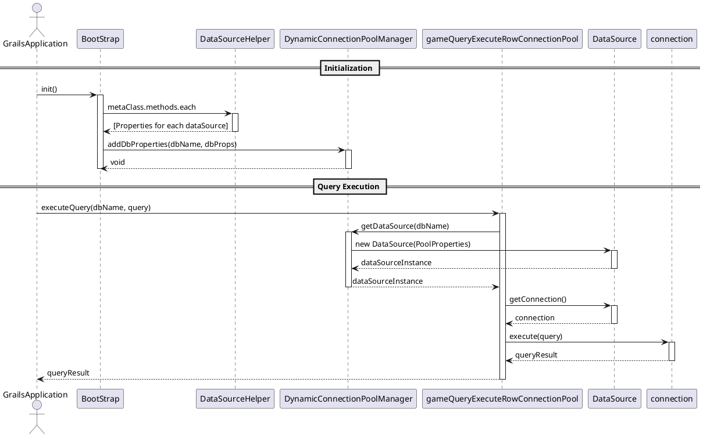

```plantuml
@startuml

actor GrailsApplication

participant BootStrap

participant DataSourceHelper

participant DynamicConnectionPoolManager

participant gameQueryExecuteRowConnectionPool

participant DataSource

  

== Initialization ==

GrailsApplication -> BootStrap: init()

activate BootStrap

BootStrap -> DataSourceHelper: metaClass.methods.each
activate DataSourceHelper
DataSourceHelper --> BootStrap: [Properties for each dataSource]
deactivate DataSourceHelper
BootStrap -> DynamicConnectionPoolManager: addDbProperties(dbName, dbProps)
activate DynamicConnectionPoolManager
DynamicConnectionPoolManager --> BootStrap: void
deactivate DynamicConnectionPoolManager
deactivate BootStrap
== Query Execution ==
GrailsApplication -> gameQueryExecuteRowConnectionPool: executeQuery(dbName, query)
activate gameQueryExecuteRowConnectionPool
gameQueryExecuteRowConnectionPool -> DynamicConnectionPoolManager: getDataSource(dbName)
activate DynamicConnectionPoolManager
DynamicConnectionPoolManager -> DataSource: new DataSource(PoolProperties)
activate DataSource
DataSource --> DynamicConnectionPoolManager: dataSourceInstance
deactivate DataSource
DynamicConnectionPoolManager --> gameQueryExecuteRowConnectionPool: dataSourceInstance
deactivate DynamicConnectionPoolManager
gameQueryExecuteRowConnectionPool -> DataSource: getConnection()
activate DataSource
DataSource --> gameQueryExecuteRowConnectionPool: connection
deactivate DataSource
gameQueryExecuteRowConnectionPool -> connection: execute(query)
activate connection
connection --> gameQueryExecuteRowConnectionPool: queryResult
deactivate connection
gameQueryExecuteRowConnectionPool --> GrailsApplication: queryResult

deactivate gameQueryExecuteRowConnectionPool

@enduml
```

