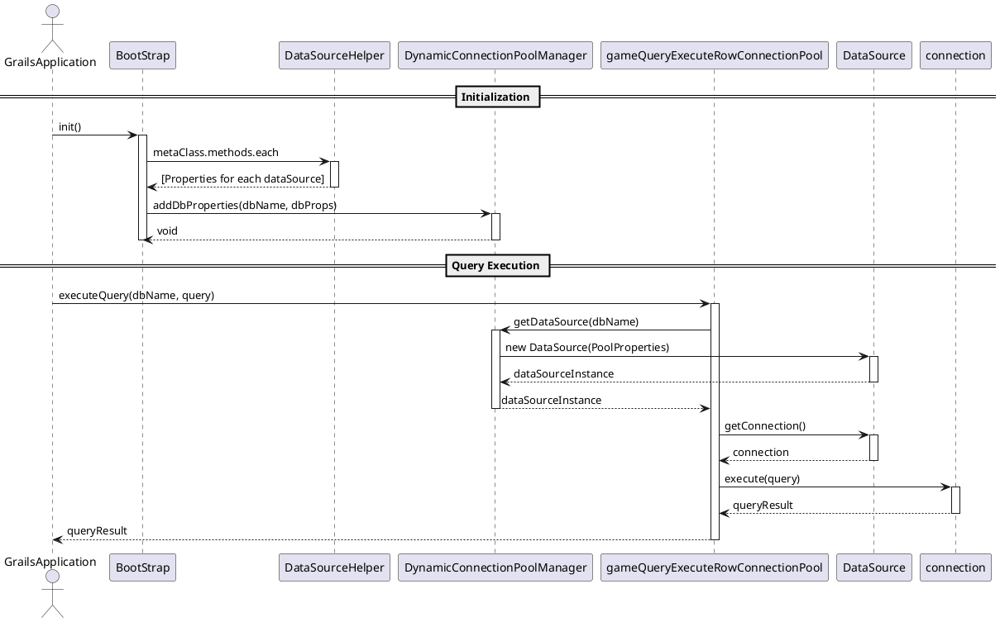

```plantuml
participant BootStrap
participant DataSourceHelper
participant DynamicConnectionPoolManager
== Initialization ==
GrailsApplication -> BootStrap: init()
activate BootStrap
BootStrap -> DataSourceHelper: metaClass.methods.each
activate DataSourceHelper
DataSourceHelper --> BootStrap: [Properties for each dataSource]
deactivate DataSourceHelper
BootStrap -> DynamicConnectionPoolManager: addDbProperties(dbName, dbProps)
activate DynamicConnectionPoolManager
DynamicConnectionPoolManager --> BootStrap: void
deactivate DynamicConnectionPoolManager
deactivate BootStrap
```

![[Pasted image 20240125112108.png]]


```plantuml
actor GrailsApplication
participant BootStrap
participant DataSourceHelper
participant DynamicConnectionPoolManager
participant CommonGameService
participant DataSource
== Query Execution ==
GrailsApplication -> CommonGameService: executeQuery(dbName, query)
activate gameQueryExecuteRowConnectionPool
CommonGameService -> DynamicConnectionPoolManager: getDataSource(dbName)
activate DynamicConnectionPoolManager
DynamicConnectionPoolManager -> DataSource: new DataSource(PoolProperties)
activate DataSource
DataSource --> DynamicConnectionPoolManager: dataSourceInstance
deactivate DataSource
DynamicConnectionPoolManager --> CommonGameService: dataSourceInstance
deactivate DynamicConnectionPoolManager
CommonGameService -> DataSource: getConnection()
activate DataSource
DataSource --> CommonGameService: connection
deactivate DataSource
CommonGameService -> connection: execute(query)
activate connection
connection --> CommonGameService: queryResult
deactivate connection
CommonGameService --> GrailsApplication: queryResult
deactivate CommonGameService
```

TwelveSky2OriginService.groovy
```groovy
String query = String.format(  
"DECLARE @result int exec @result = %s..SP_CountGiftItemSlot '%s' SELECT @result as result"  
,"ACCOUNT2"  
,user.username  
)  
String dataSourceName = 'dataSource_12sky2ori'  
String logPath = 'gameItemSendLog/12sky2OriSlotCheck'  
def result2 = commonGameService.gameQueryExecuteRowConnectionPool(dataSourceName,query, logPath)
```
