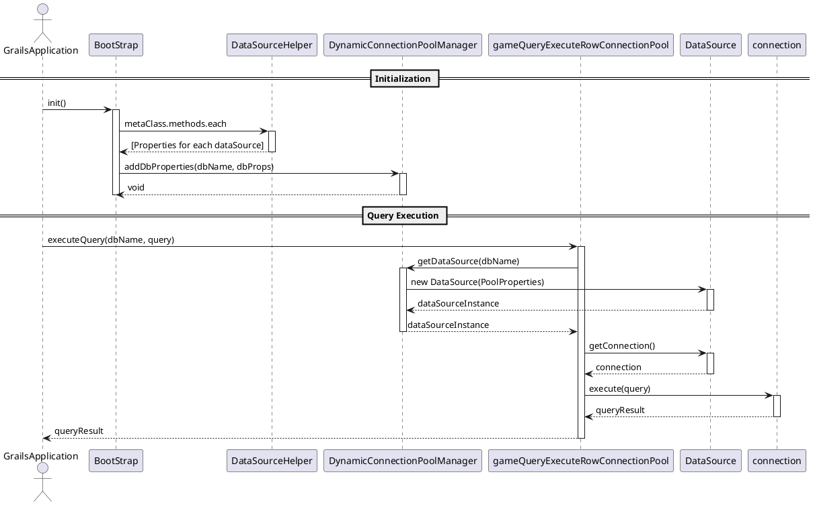

```plantuml
participant BootStrap
participant DataSourceHelper
participant DynamicConnectionPoolManager
== Initialization ==
GrailsApplication -> BootStrap: init()
activate BootStrap
BootStrap -> DataSourceHelper: metaClass.methods.each
activate DataSourceHelper
DataSourceHelper --> BootStrap: [Properties for each dataSource]
deactivate DataSourceHelper
BootStrap -> DynamicConnectionPoolManager: addDbProperties(dbName, dbProps)
activate DynamicConnectionPoolManager
DynamicConnectionPoolManager --> BootStrap: void
deactivate DynamicConnectionPoolManager
deactivate BootStrap
```

![[Pasted image 20240125112108.png]]


```plantuml
actor GrailsApplication
participant BootStrap
participant DataSourceHelper
participant DynamicConnectionPoolManager
participant CommonGameService
participant DataSource
== Query Execution ==
GrailsApplication -> CommonGameService: executeQuery(dbName, query)
activate gameQueryExecuteRowConnectionPool
CommonGameService -> DynamicConnectionPoolManager: getDataSource(dbName)
activate DynamicConnectionPoolManager
DynamicConnectionPoolManager -> DataSource: new DataSource(PoolProperties)
activate DataSource
DataSource --> DynamicConnectionPoolManager: dataSourceInstance
deactivate DataSource
DynamicConnectionPoolManager --> CommonGameService: dataSourceInstance
deactivate DynamicConnectionPoolManager
CommonGameService -> DataSource: getConnection()
activate DataSource
DataSource --> CommonGameService: connection
deactivate DataSource
CommonGameService -> connection: execute(query)
activate connection
connection --> CommonGameService: queryResult
deactivate connection
CommonGameService --> GrailsApplication: queryResult
deactivate CommonGameService
```

TwelveSky2OriginService.groovy
```groovy
String query = String.format(  
"DECLARE @result int exec @result = %s..SP_CountGiftItemSlot '%s' SELECT @result as result"  
,"ACCOUNT2"  
,user.username  
)  
String dataSourceName = 'dataSource_12sky2ori'  
String logPath = 'gameItemSendLog/12sky2OriSlotCheck'  
def result2 = commonGameService.gameQueryExecuteRowConnectionPool(dataSourceName,query, logPath)
```

CommonGameService.groovy
gameQueryExecuteRowConnectionPool
```groovy
def gameQueryExecuteRowConnectionPool(String dataSourceName, String query, String logPath){
        Connection conn = null
        Sql sql = null
        def map = [:]
        try{
            DataSource dataSource = null
//            String dataSourceName = dbInfo.get("dataSourceName").toString() //dataSource_audition
            if(dataSourceName) {
                dataSource = DynamicConnectionPoolManager.getDataSource(dataSourceName)
            }else{
                return map.put('Return',false)
            }
            conn = dataSource.getConnection()
            sql = new Sql(conn)
            if(conn) {
                sql.eachRow(query,
                        {
                            it.getProperties().metaData.each{ obj -> map.put(obj.columnName, it.getAt(obj.columnName))  }
                        }
                )
                if(logPath){
                    String logString = "query: $query, queryResult: $map.toString()"
                    Logger.log3(logString,logPath)
                }
            }
        }catch(Exception e){
            map.put('Return', false)
            String errMsg = e.printStackTrace()
            if(logPath){
                String logString = "query: $query, errMsg: $errMsg"
                Logger.log3(logString,logPath)
            }
        }finally{
            sql?.close()
            conn?.close()
        }
        return map
    }
```


DynamicConnectionPoolManager.groovy
```groovy
 static DataSource getDataSource(String dataSourceName) {
        DataSource dataSource = dataSources.get(dataSourceName)
        /*
        DataSource 가 생성되지 않고 get한 DataSource 가 null 일 때
         */
        if(!dataSources.containsKey(dataSourceName) || dataSource == null) { // 첫번째 null 체크 동기화전
            synchronized (DynamicConnectionPoolManager.class) { // 동기화 내부로 진입 -> 임계영역으로 진입.( 멀티 프로세스 내에서 동시에 실행 되면 안되는 코드 영역)
                dataSource = dataSources.get(dataSourceName)
                if(dataSource == null){ // 여기서 null 체크를 다시 해서 멀티쓰레드 환경에서 동시에 initializeDataSource 가 실행되는걸 막아줌
                    dataSource = initializeDataSource(dataSourceName)
                }
            }
        }else {
            // 검증을 통해서 Connection Pool 의 상태를 확인하고 재 설정 해주는 메서드
            validateAndRefreshDataSource(dataSource, dataSourceName)
        }
        return dataSource
    }
    private static DataSource initializeDataSource(String dataSourceName) {
        Properties dbProps = dbPropertiesMap.get(dataSourceName)
        if(dbProps != null && !dbProps.isEmpty()) {
            String msg = ""
            try{
                DataSource newDataSource = createDataSource(dbProps)
                // putIfAbsent 는 thread-safe 값이 없을 때만 넣음
                dataSources.putIfAbsent(dataSourceName, newDataSource)
                return newDataSource
            }catch(Exception e){
                msg = "[initializeDataSource] dataSourceName : ${dataSourceName}. Error: DataSource initialization failed for dataSourceName : ${dataSourceName}"
                saveErrorLogToDB(msg,'initializeDataSource')
                Logger.log3(msg, 'DynamicConnectionPoolManager')
                e.printStackTrace()
            }
        }else {
            String msg = "[initializeDataSource] dataSourceName : ${dataSourceName}. Error: No database Properties: ${dataSourceName}"
            Logger.log3(msg, 'DynamicConnectionPoolManager')
            saveErrorLogToDB(msg,'initializeDataSource')
            throw new IllegalStateException("No database Properties: ${dataSourceName}")
        }
    }
    private static void validateAndRefreshDataSource(DataSource dataSource, String dataSourceName) {
        Properties dbProps = dbPropertiesMap.get(dataSourceName)
        String dbType = dbProps.get("dbType").toString()
        String msg =""
        /*
            Connection 이 있다가 네트워크 문제로 끊겼다가 재연결 될때 Exception 이 나옴.
            create 하다가 예외 발생 시 dataSource Map 에서 삭제
            valid 통과 시에는 그냥 넘김
             */
        if(!isConnectionValid(dataSource, dbType, dataSourceName)) {
            try {
                closeConnectionPool(dataSourceName);
                DataSource newDataSource = createDataSource(dbProps);
                /*
                validateAndRefreshDataSource 가 호출 되는 조건이 데이터 소스가 이미 dataSources 맵에 존재하는 경우이다.
                 */
                dataSources.replace(dataSourceName, newDataSource);
            } catch (Exception e) {
                closeConnectionPool(dataSourceName);
                dataSources.remove(dataSourceName);
                // 로깅 및 예외 처리
                msg = "[validateAndRefreshDataSource] dataSourceName : ${dataSourceName}. Error: Failed to recreate DataSource for ${dataSourceName}"
                saveErrorLogToDB(msg,'validateAndRefreshDataSource')
                Logger.log3(msg, 'DynamicConnectionPoolManager')
                throw new RuntimeException("Failed to recreate DataSource for " + dataSourceName, e);
            }
        }
    }
```

---
해당 게임 DB 의 Connection Pool 이 없을 때

DynamicConnectionPoolManager
createDataSource
```groovy
private static synchronized DataSource createDataSource(Properties dbProps) {
        PoolProperties p = new PoolProperties()
        String dataSourceName = dbProps.get("dataSourceName") // 실제 사용되는 db 이름
        String dbType = dbProps.get("dbType") // mysql, oracle, postgresql, mssql
        p.setUrl(dbProps.get("url").toString())
        p.setDriverClassName(dbProps.get("dbDriver").toString())
        p.setUsername(dbProps.get("username").toString())
        p.setPassword(dbProps.get("password").toString())
        def connectionProperty =[:]
        if(Environment.current.name == 'test'){
            connectionProperty = dbType == 'oracle'? DataSourceConfig.dbPropertiesForTestOracle.call() : DataSourceConfig.dbPropertiesForTest.call()
        }else if (Environment.current.name == 'production') {
            connectionProperty = dbType == 'oracle'? DataSourceConfig.dbPropertiesForLiveOracle.call() : DataSourceConfig.dbPropertiesForLive.call()
        }
        if(!connectionProperty.isEmpty()){
            p.setJmxEnabled((Boolean)connectionProperty.get("jmxEnabled"))
            p.setInitialSize(connectionProperty.get("initialSize").toString().toInteger())
            p.setMaxActive(connectionProperty.get("maxActive").toString().toInteger())
            p.setMinIdle(connectionProperty.get("minIdle").toString().toInteger())
            p.setMaxIdle(connectionProperty.get("maxIdle").toString().toInteger())
            p.setMaxWait(connectionProperty.get("maxWait").toString().toInteger())
            p.setMaxAge(connectionProperty.get("maxAge").toString().toInteger())
          p.setTimeBetweenEvictionRunsMillis(connectionProperty.get("timeBetweenEvictionRunsMillis").toString().toInteger())
           p.setMinEvictableIdleTimeMillis(connectionProperty.get("minEvictableIdleTimeMillis").toString().toInteger())
            p.setValidationQuery(connectionProperty.get("validationQuery").toString())
           p.setValidationQueryTimeout(connectionProperty.get("validationQueryTimeout").toString().toInteger())
            p.setValidationInterval(connectionProperty.get("validationInterval").toString().toInteger())
            p.setTestOnBorrow((Boolean)connectionProperty.get("testOnBorrow"))
            p.setTestWhileIdle((Boolean)connectionProperty.get("testWhileIdle"))
            p.setTestOnReturn((Boolean)connectionProperty.get("testOnReturn"))
            p.setJdbcInterceptors(connectionProperty.get("jdbcInterceptors").toString())
       p.setDefaultTransactionIsolation(connectionProperty.get("defaultTransactionIsolation").toString().toInteger())
        }
        return new DataSource(p)
    }
```

-----

순서
BootStrap.groovy 에서 DB Connection Pool 생성 시 필요한 DB Properties 를 
```groovy
private static final Map<String, Properties> dbPropertiesMap = [:]
```
에 저장? 함.
==static final 키워드는 해당 필드가 클래스의 인스턴스 간에 공유되며, 한번 초기화 되면 그 값이 변경 되지 않음을 의미함....
즉 변수 자체의 참조가 변경되지 않는다는 것이고, 변수가 참조하는 객체의 내부 상태는 변경될 수 있음.==

그 후에 Connection Pool 을 생성하고 있지 않다가 TwelveSky2OriService 같은 곳에서 DynamicConnectionPoolManager 에 있는 getDataSource 호출 시 
```groovy
if(!dataSources.containsKey(dataSourceName) || dataSource == null) { // 첫번째 null 체크 동기화전
            synchronized (DynamicConnectionPoolManager.class) { // 동기화 내부로 진입 -> 임계영역으로 진입.( 멀티 프로세스 내에서 동시에 실행 되면 안되는 코드 영역)
                dataSource = dataSources.get(dataSourceName)
                /*
                동기화 내부에서의 null 체크 => 이미 다른 쓰레드가 동기화로 들어오기 전에 DataSource 리소스를 초기화 했을 수도 있어서
              */
                if(dataSource == null){
                    Properties dbProps = dbPropertiesMap.get(dataSourceName)
                    if(dbProps != null && !dbProps.isEmpty()){
                        // dataSource 가 여전히 null 이라면 dataSource 초기화
                        dataSource = createDataSource(dbProps)
                        dataSources.put(dataSourceName, dataSource)
                    }else {
                        throw new IllegalStateException("No database Properties: " + dataSourceName)
                    }
                }
            }
```
이 if 절에서 걸려서 createDataSource 로 Connection Pool 을 생성하게 됨.
synchronized 한 이유는 멀티 쓰레드에서 해당 getDataSource 를 실행할 때 둘다 null 로 나와서 createDataSource 를 실행시킬 수 있기 때문. 

그래서 getDataSource 부분은 Double-Checked Lock 패턴으로 동기화 블록에 들어가기 전에 null 체크 , 임계영역에 들어간 후 null 체크를 2번하게 끔 되있다.

createDataSource 는
```groovy
PoolProperties p = new PoolProperties()
        String dataSourceName = dbProps.get("dataSourceName") // 실제 사용되는 db 이름
        String dbType = dbProps.get("dbType") // mysql, oracle, postgresql, mssql
        p.setUrl(dbProps.get("url").toString())
        p.setDriverClassName(dbProps.get("dbDriver").toString())
        p.setUsername(dbProps.get("username").toString())
        p.setPassword(dbProps.get("password").toString())  
        def connectionProperty =[:]
        if(Environment.current.name == 'test'){
            connectionProperty = dbType == 'oracle'? DataSourceConfig.dbPropertiesForTestOracle.call() : DataSourceConfig.dbPropertiesForTest.call()
        }else if (Environment.current.name == 'production') {
            connectionProperty = dbType == 'oracle'? DataSourceConfig.dbPropertiesForLiveOracle.call() : DataSourceConfig.dbPropertiesForLive.call()
        }
        if(!connectionProperty.isEmpty()){
            p.setJmxEnabled((Boolean)connectionProperty.get("jmxEnabled"))
            p.setInitialSize(connectionProperty.get("initialSize").toString().toInteger())
            p.setMaxActive(connectionProperty.get("maxActive").toString().toInteger())
            p.setMinIdle(connectionProperty.get("minIdle").toString().toInteger())
            p.setMaxIdle(connectionProperty.get("maxIdle").toString().toInteger())
            p.setMaxWait(connectionProperty.get("maxWait").toString().toInteger())
            p.setMaxAge(connectionProperty.get("maxAge").toString().toInteger())
           p.setTimeBetweenEvictionRunsMillis(connectionProperty.get("timeBetweenEvictionRunsMillis").toString().toInteger())
            p.setMinEvictableIdleTimeMillis(connectionProperty.get("minEvictableIdleTimeMillis").toString().toInteger())
            p.setValidationQuery(connectionProperty.get("validationQuery").toString())
           p.setValidationQueryTimeout(connectionProperty.get("validationQueryTimeout").toString().toInteger())
            p.setValidationInterval(connectionProperty.get("validationInterval").toString().toInteger())
            p.setTestOnBorrow((Boolean)connectionProperty.get("testOnBorrow"))
            p.setTestWhileIdle((Boolean)connectionProperty.get("testWhileIdle"))
            p.setTestOnReturn((Boolean)connectionProperty.get("testOnReturn"))
            p.setJdbcInterceptors(connectionProperty.get("jdbcInterceptors").toString())
            p.setDefaultTransactionIsolation(connectionProperty.get("defaultTransactionIsolation").toString().toInteger())
        }
        return new DataSource(p)
```
이렇게 처음에 dbPropertiesMap 에 저장된 값을 dataSourceName 으로 가져와서 Connection Pool 을 맺는 과정을 거침.


## 이미 있는 Connection Pool 은?
게임 데이터베이스가 점검날 아름답게 점검 때려버리면 Connection Pool 은 잡고 있는 상태로 네트워크만 끊어져 Connection Pool 이 이상하게 된다.
그렇게 다시 DB 연결이 되서 재시도 하게 되면 이미 닫힌 Connection 에 연결을 넣는다는 error 가 나오게 된다.

그러므로 getDataSource 를 할때 
```groovy
else {
            // 이미 생성된 DataSource에 대한 유효성 검사
            Properties dbProps = dbPropertiesMap.get(dataSourceName)
            DataSource createdDataSource = dataSources.get(dataSourceName)
            String dbType = dbProps.get("dbType").toString()
            /*
            Connection 이 있다가 네트워크 문제로 끊겼다가 재연결 될때 Exception 이 나옴.
            create 하다가 터졌을 때 dataSource Map 에서 삭제
            valid 통과 시에는 그냥 넘김
             */
            if(!isConnectionValid(createdDataSource,dbType)) {
                // 유요하지 않은 경우, dataSource 재 생성
                try{
                    closeConnectionPool(dataSourceName)
                    createdDataSource = createDataSource(dbProps)
                    dataSources.put(dataSourceName, createdDataSource)
                }catch(Exception e ){
                    closeConnectionPool(dataSourceName)
                    dataSources.remove(dataSourceName)
                    throw new RuntimeException("Failed to recreate DataSource for $dataSourceName: ${e.message}", e)
                }
            }
        }
```
else 조건에 걸려서 dataSource 가 유효한지 validationQuery 를 날린다.

검증 실패 시에는 closeConnectionPool 을 호출해서 검증 실패한 ConnectionPool 의 연결을 해제한다.
```groovy
private static void closeConnectionPool(String dataSourceName) {
        DataSource dataSource = dataSources.get(dataSourceName)
        if(dataSource != null){
            try{
                dataSource.close()
            }catch(Exception e){
                // log 남기기
                e.printStackTrace()
            }
        }
    }
```

isConnectionValid 에서는
```groovy
private static boolean isConnectionValid(DataSource dataSource, String dbType) {
        String query = "SELECT 1"
        if(dbType && dbType == 'oracle'){
            query = "SELECT 1 FROM DUAL"
        }
        try {
            Connection conn = dataSource.getConnection()
            Statement stmt = conn.createStatement()
            stmt.executeQuery(query)
            conn.close()
            return true
        } catch (SQLException e) {
            return false
        }
    }
```
MySQL 의 경우에는 SELECT 1 , Oracle 에 경우에는 SELECT 1 FROM DUAL 이라는 validation query 를 날려서 Connection 을 확인하게 된다. 

SELECT 1 을 했을 때 안되면 다시 createDataSource 를 하게 된다.

---

Error Log 저장 방법
```groovy
private static void saveErrorLogToDB(String msg, String methodName) {
        def commonLog = new CommonLog()
        commonLog.fromInfo = methodName
        commonLog.log = msg
        commonLog.description = methodName
        commonLog.logLevel = 'ERROR'
        try{
         commonLog.save(flush:true, failOnError: true)
        }catch(Exception e) {
            Logger.log3("[saveErrorLogToDB] Fail to save log to DB.", 'DynamicConnectionPoolManager')
            e.printStackTrace()
        }
    }
```

/var/log/happycode/check/DynamicConnectionPoolManager 에 로그가 쌓이고
happycode DB 에 common_log 테이블에 쌓인다.
LOG_LEVEL 은 ERROR 로 쌓이게 된다.

| ID   | version | date_created           | description     | from_info      | log                                                                      | Error Level |
|------|-------|---------------------|----------------|------------------|----------------------------------------------------------------------------------|-------------|
| 3506 | 0     | 2024-01-30 15:42:45 | isConnectionValid | isConnectionValid | [isConnectionValid] dataSourceName : dataSource_audition. Error: Connection validation failed for dataSourceName: dataSource_audition | ERROR       |
| 3505 | 0     | 2024-01-30 15:33:35 | isConnectionValid | isConnectionValid | [isConnectionValid] dataSourceName : dataSource_audition. Error: Connection validation failed for dataSourceName: dataSource_audition | ERROR       |
