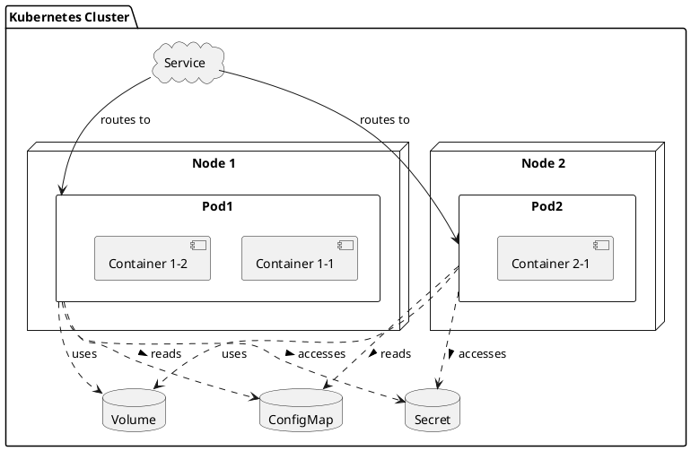

# PODS

### 파드(Pods)

- **기본 단위**: 파드는 쿠버네티스에서 애플리케이션을 실행하는 가장 작은 단위. 하나의 파드는 하나 이상의 컨테이너를 포함할 수 있으며, 이 컨테이너들은 스토리지, 네트워크를 공유하고, 어떻게 실행될지에 대한 설정을 함께 가진다.
- **컨테이너 묶음**: 일반적으로, 파드는 서로 밀접하게 연관된 기능을 수행하는 컨테이너를 묶어서 관리한다. 예를 들어, 메인 애플리케이션 컨테이너와 로그 수집, 모니터링을 위한 사이드카(sidecar) 컨테이너가 함께 파드를 구성할 수 있다.
- **생명주기**: 파드는 일시적인(ephemeral) 리소스. 파드가 실행되는 노드에 장애가 발생하면, 해당 파드는 손실되고, 레플리카셋(ReplicaSet)이나 디플로이먼트(Deployment)에 의해 다른 노드에 새로운 파드가 생성된다.

# SERVICE
### 서비스(Services)

- **네트워크 추상화**: 서비스는 하나 이상의 파드에 대한 안정적인 네트워크 주소를 제공하는 쿠버네티스 리소스. 서비스를 통해 파드 그룹에 접근할 때 사용하는 IP 주소와 포트는 파드가 재생성되어 IP가 변경되더라도 변하지 않는다.
- **로드 밸런싱**: 서비스는 파드 그룹에 대한 네트워크 트래픽을 자동으로 분산시키는 기능을 한다. 클라이언트는 서비스를 통해 파드 그룹에 요청을 보내면, 서비스는 이 요청을 파드들 사이에 로드 밸런싱한다.
- **서비스 타입**: 쿠버네티스는 여러 종류의 서비스를 제공한다. 예를 들어, `ClusterIP` 서비스는 클러스터 내부에서만 접근 가능한 내부 IP를 제공하고, `NodePort`와 `LoadBalancer` 서비스는 클러스터 외부에서 파드 그룹에 접근할 수 있게 한다.

_PODS 와 SERVICE 는 서로 독립적인 관계
SERVICE 는 PODS들에 대한 네트워크 접근을 제공하는 추상적인 레이어로써 작동함._

_SERVICE 는 같은 IP 대역대로 묶어서 각 PODS들 끼리의 통신이 가능하게 하는거라고 이해하면됨._ ⬇️
### 서비스를 통한 파드 간 통신

- **내부 통신**: 쿠버네티스 클러스터 내부에서, 서비스는 파드들 사이의 내부 통신을 위한 안정적인 방법을 제공한다. 서비스는 특정 포트를 통해 트래픽을 받아, 선택된 파드들 중 하나로 트래픽을 전달한다. 이 과정은 로드 밸런싱을 자동으로 처리한다.
    
- **동일 대역대 통신**: 쿠버네티스 클러스터는 내부적으로 파드와 서비스에 대해 별도의 IP 주소 대역을 할당한다. 클러스터 내의 모든 컴포넌트는 이 내부 네트워크를 통해 서로 통신할 수 있으며, 서비스를 통해 파드들 간의 통신도 이 대역대 내에서 이루어진다.
    

### 서비스의 역할

- **접근 지점 제공**: 서비스는 파드 그룹에 대한 접근 지점 역할을 하여, 파드들이 삭제되거나 새로 생성될 때 IP 주소가 변경되더라도 일관된 접근 방법을 제공한다.
    
- **로드 밸런싱**: 서비스는 네트워크 트래픽을 파드들 사이에 분산시키는 역할을 한다. 이는 파드들의 부하를 균등하게 분배하여, 애플리케이션의 가용성과 확장성을 향상시킨다.
    
- **추상화 및 간소화**: 서비스를 사용함으로써, 파드의 실제 네트워크 주소를 알 필요 없이 파드 그룹에 접근할 수 있다. 이는 애플리케이션 구성을 단순화하고, 클러스터 내에서 서비스 간의 통신을 쉽게 구성할 수 있게 한다.

Cluster -> Pods 이렇게 있는데 Cluster 끼리도 Service 로 묶일 수 있나?
➡️ ㄴㄴ, service 는 Pods 들의 통신만, 클러스터끼리는 로드밸런싱 직접적인 통신? 은 안됨.

여기서 생기는 궁금증
1. Cluster 는 동일하게 만들어서 로드밸런싱을 해서 부하를 줄이는 방법이 적절한 사용방법인지 아니면 원래 그렇게 하는건지 
2. 한 클러스터 내에서는 Service 가 많이 존재해야하는건지 
3. service 는 VPC 개념으로 이해하면 되는지

#### 1. 클러스터 로드밸런싱과 부하 분산
로드밸런싱으로 부하 분산 하는거 맞음.

#### 2. 서비스 역할과 필요성
서비스는 Pods 들의 집합에 대한 안정적인 접근 방법을 제공함. 로드밸런싱, 이름을 통한 서비스 디스커버리 등의 기능을함.

#### 3. VPC 와의 차이점.
- **서비스와 VPC의 차이**: 서비스는 쿠버네티스 내부에서 파드들의 논리적인 집합에 대한 네트워크 접근을 관리하는 오브젝트. 반면, VPC(가상 사설 클라우드)는 클라우드 환경에서 사용자가 정의할 수 있는 격리된 네트워크 세그먼트로, 보다 광범위한 네트워크 관리와 구성을 가능하게 한다.
- **개념적 차이**: VPC는 네트워크의 물리적 구조와 보안을 추상화하는 클라우드 인프라 수준의 개념이며, 서비스는 쿠버네티스 애플리케이션 수준에서의 네트워크 추상화를 제공한다. 즉, 서비스는 VPC 내에서 작동하는 애플리케이션 구성 요소를 논리적으로 묶는 역할을 하며, VPC는 그러한 서비스들이 작동하는 더 넓은 네트워크 환경을 제공한다.

➡️ 인프라 수준이냐 애플리케이션 수준이냐 이 차이인듯..

#### 4. 클러스터는 VM 하고 비슷함?
동일하게 보기에는 한계가 있음.

* 쿠버네티스 클러스터
	* 추상화 수준 : 컨테이너화 된 애플리케이션을 관리하기 위한 추상화를 제공함. 클러스터는 여러 노드로 구성되며, 이 노드들 위에서 컨테이너화된 애플리케이션(PODS)이 실행됨..
	* 왜?(목적): 쿠버네티스는 애플리케이션의 배포, 확장 및 관리를 자동화하는 것을 목표로 한다. 클러스터는 애플리케이션의 실행을 위한 리소스(컴퓨팅, 스토리지, 네트워크)를 효율적으로 분배하고, 실패한 컴포넌트를 자동으로 복구하는 등의 기능을 제공함.
* VM
	* 부하 대응 : 기존 VM 시스템에서는 바하가 증가할 때 추가 VM 인스턴스를 생성하고, 거기에 소프트웨어를 배포하여 부하를 분산시킬 수 있음. 이는 스케일 아웃 방식이여서 필요에 따라 리소스를 동적으로 확장할 수 있게 해줌.
	* 쿠버네티스의 접근 방식 : 쿠버네티스에서는 파드의 수를 늘리거나 줄여서(수평확장의 개념임ㅇㅇ) 부하에 대응함... 쿠버네티스는 이러한 스케일링을 자동으로 관리할 수 있고, 애플리케이션의 상태를 모니터링 하고 필요에 따라 파드를 추가하거나 삭제함.

K8s 는 위ㅣ대하다....그닥...

결론은 
쿠버네티스 클러스터와 VM은 서로 다른 추상화 수준과 목적을 가지고 있다

## 구성 성분
- 클러스터 (Cluster)
    
    1. 쿠버네티스 시스템 전체를 의미하는 최상위 단위
    2. 여러 노드(Node) 들로 구성되며, 이 노드들은 컨테이너화된 애플리케이션을 실행하는 물리적 또는 가상의 서버
    3. 클러스터는 애플리케이션의 실행, 스케일링, 관리를 중앙에서 조정한다.
- 노드(Node)
    
    1. 클러스터를 구성하는 각 서버(물리적 또는 가상) 을 의미
    2. 각 노드는 여러 개의 파드(Pods) 를 실행할 수 있으며, 쿠버네티스에 의해 관리됨.
    3. 마스터 노드(Master Node) 와 워커 노드(Worker Node) 로 구분됨.
        - 마스터 노드 : 클러스터 관리, 스케줄링, API 서비스 등 중앙 관리 역할을 수행
        - 워커 노드 : 실제로 애플리케이션 파드를 실행하는 노드
- 파드(Pods)
    
    1. 쿠버네티스에서 배포 가능한 가장 작은 단위
    2. 하나 이상의 컨테이너를 포함할 수 있고, 이 컨테이너들을 스토리지, 네트워킹을 공유하고 같은 방식으로 관리됨.
    3. 각 파드는 고유한 IP 주소를 가지고, 파드 내의 컨테이너들은 로컬호스트를 통해 서로 통신할 수 있음.
- 서비스(Service)
    
    1. 하나의 클러스터 내에서 별도의 논리적 분리를 제공
    2. 리소스를 그룹화하여 여러 팀이나 프로젝트 간의 격리를 도모할 수 있음.
    3. 리소스 이름 충돌을 방지하고, 접근 제어 및 리소스 할당을 더 세밀하게 관리 할 수 있음.
- 볼륨(Volume)
    
    1. 파드 내의 컨테이너들은 재시작될 때마다 리셋되는 일시적인 스토리지를 가지고 있음. 볼륨은 이러한 데이터의 지속성과 파드 내의 컨테이너들 간 데이터 공유를 가능하게 하는 메커니즘을 제공함.
    2. 볼륨은 파드와 동일한 수명을 가짐. 즉, 볼륨은 파드가 존재하는 동안에만 존재하며, 파드가 삭제 될 때 함께 제거됨.
    3. 여러 타입의 볼륨이 지원되며, NFS, 클라우드 스토리지(AWS EBS, Azure Dist, Google Persistent Disk 등), 로컬 스토리지, 메모리 등 다양한 백엔드 스토리지를 사용할 수 있음.
- 컨피그맵(ConfigMap)
    
    1. 애플리케이션의 설정을 키-값 쌍으로 저장, 이를 파드에 전달하는데 사용
    2. 환경 변수, 커맨드라인 인자, 설정 파일 등의 형태로 컨테이너에 적용될 수 있음.
    3. 애플리케이션 코드와 분리하여 구성 정보를 관리할 수 있게 해줌으로써, 애플리케이션의 재배포 없이도 설정을 변경할 수 있음.
- 시크릿(Secret)
    
    1. 비밀번호, OAuth 토큰, SSH 키와 같은 민감한 정보를 저장, 파드에 안전하게 전달하는데 사용됨.
    2. 시크릿 데이터는 암호화되어 저장되며, 환경 변수나 볼륨을 통해 컨테이너에 마운트 될 수 있음.
    3. ConfigMap 과 유사하지만, 민감한 정보를 다루기 위한 추가적인 보안 기능을 제공함.
- 스테이트풀셋(StatefulSet)
    
    1. 상태를 유지해야 하는 분산 애플리케이션과 데이터베이스를 관리하기 위해 사용됨.
    2. 스테이트풀셋은 파드에 안정적인 고유 식별자와 순서대로 배포 및 스케일링을 보장
    3. 각 인스턴스는 안정적인 네트워크 식별자와 영구적인 스토리지를 가짐. 이를 통해 파드가 재스케줄링되거나 재시작될 때도 애플리케이션의 상태와 데이터를 유지할 수 있음.
    4. 스테이트풀셋은 복제본(Replica) 간에 순서를 보장하며, 하나의 인스턴스가 안정적으로 종료되고 정리된 후에 다음 인스턴스가 생성되도록 한다.

1. **클러스터**: 전체 쿠버네티스 시스템을 나타냅니다. 클러스터 안에는 여러 노드와 서비스, 볼륨, 컨피그맵, 시크릿 등의 리소스가 포함됨.
    
2. **노드(Node 1, Node 2)**: 클러스터를 구성하는 물리적 또는 가상의 서버. 각 노드는 하나 이상의 파드를 실행할 수 있으며, 파드는 실제로 애플리케이션 컨테이너가 실행되는 곳있다.
    
3. **파드(Pod1, Pod2)**: 쿠버네티스에서 컨테이너를 실행하는 기본 단위. 파드는 하나 이상의 컨테이너를 포함할 수 있으며, 이 예시에서는 Pod1이 Container 1-1과 Container 1-2를, Pod2가 Container 2-1을 포함한다.
    
4. **서비스(Service)**: 파드 집합에 대한 안정적인 접근 방법을 제공한다. 서비스는 파드들이 동적으로 변경되어도 일관된 접근 포인트를 유지하도록 해준다. 다이어그램에서는 서비스가 Pod1과 Pod2로의 라우팅을 담당한다.
    
5. **볼륨(Volume)**: 데이터 저장을 위해 파드에서 사용되는 영구적인 스토리지를 나타낸다. 파드는 볼륨을 통해 데이터를 저장하고, 볼륨은 파드의 생명주기와 독립적으로 존재할 수 있다.
    
6. **컨피그맵(ConfigMap) 및 시크릿(Secret)**: 애플리케이션의 설정 정보(ConfigMap)와 민감한 정보(Secret)를 저장하는데 사용된다. 파드는 이러한 정보를 환경 변수나 파일 형태로 사용할 수 있다.
    
7. **의존성 관계**: 파드는 볼륨, 컨피그맵, 시크릿과 의존성 관계를 가지고 있다. 이는 파드가 이들 리소스를 사용하여 실행되는 애플리케이션의 설정 정보, 민감한 정보, 데이터 등을 관리할 수 있음을 의미한다. 점선 화살표는 이러한 의존성 관계를 나타낸다.

