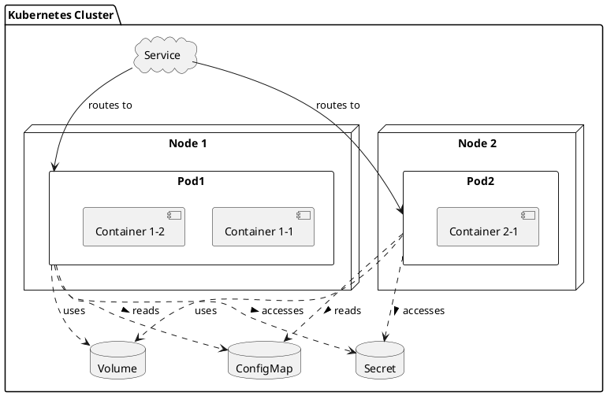

# 쿠버네티스란?

* 전통적
	물리서버에서 실행. 리소스 할당의 문제 발생
* 가상화
	전통적인 방법보다 리소스 할당에 좋음. VM 간에 격리되있어서 자유롭게 액세스가 불가능함.
* 컨테이너
	애플리케이션 간에 OS 를 공유함. 기본 인프라와의 종속성을 끊었기 때문에 클라우드나 OS 배포본에 모두 이식 가능

## 좋은 점

* 애플리케이션 생성과 배포
	VM 이미지를 사용하는 것에 비해 컨테이너 이미지 생성이 보다 쉽고 효율적
* 지속적인 개발, 통합 및 배포
	안정적이고 주기적으로 컨테이너 이미지를 빌드해서 배포할 수 있고(이미지 불변성) 빠르고 효율적으로 롤백 가능
* 개발과 운영의 관심사 분리
	배포 시점이 아닌 빌드/ 릴리스 시점에 애플리케이션 컨테이너 이미지를 만들기 때문에, 애플리케이션이 인프라에서 분리됨.
* 가시성
	OS 수준의 정보와 메트릭에 머무르지 않고, 애플리케이션의 헬스와 그 밖의 시그널을 볼 수 있음.
* 개발,테스팅 및 운영 환경에 걸친 일관성
	랩탑에서도 클라우드에서와 동일하게 구동됨.
* 클라우드 및 OS 배포판 간 이식성
	우분투, RHEL, CoreOS, 온-프레미스, 주요 퍼블릭 클라우드와 어디에서든 구동됨.
* 애플리케이션 중심 관리
	가상 하드웨어 상에서 OS 를 실행하는 수준에서 논리적인 리소스를 사용하는 OS 상에서 애플리케이션을 실행하는 수준으로 추상화 수준이 높아짐.
* 자유로운 MSA
	애플리케이션은 단일 목적의 머신에서 모놀리식 스택으로 구동되지 않고 보다 작고 독립적인 단위로 쪼개져서 동적으로 배포되고 관리될 수 있음.
		리소스 격리 : 애플리케이션 성능을 예측할 수 있음.
		리소스 사용량 : 고효율 고집적.

## 왜 필요함?
* 서비스 디스커버리와 로드 밸런싱
	  쿠버네티스는 DNS 이름을 사용하거나 자체 IP 주소를 사용하여 컨테이너를 노출할 수 있음. 컨테이너에 대한 트래픽이 많으면, k8s 는 네트워크 트래픽을 로드밸런싱하고 배포하여 배포가 안정적으로 이루어질 수 있음.
* 스토리지 오케스트레이션
	k8s 를 사용하면 로컬 저장소, 공용 클라우드 공급자 등과 같이 원하는 저장소 시스템을 자동으로 탑재할 수 있음.
* 자동화된 롤아웃과 롤백
	  k8s 를 사용하여 배포된 컨테이너의 원하는 상태를 서술할 수 있으며 현재 상태를 원하는 상태로 설정한 속도에 따라 변경할 수 있음. k8s 를 자동화해서 배포용 새 컨테이너를 만들고, 기존 컨테이너를 제거하고, 모든 리소스를 새 컨테이너에 적용할 수 있음.
* 자동화된 빈 패킹(bin packing)
	  컨테이너화 된 작업을 실행하는데 사용할 수 있는 k8s 클러스터 노드를 제공함. 각 컨테이너가 필요로 하는 CPU와 RAM 을 쿠버네티스에서 지시한다. k8s 는 컨테이너를 노드에 맞춰서 리소스를 가장 잘 사용할 수 있도록 함.
* 자동화된 복구(self-healing)
	k8s는 실패한 컨테이너를 다시 시작하고, 컨테이너를 교체하며, '사용자 정의 상태 검사' 에 응답하지 않는 컨테이너를 죽이고, 서비스 준비가 끝날 때 까지 그러한 과정을 클라이언트에게 보여주지 않음.  
* 시크릿과 구성관리
	k8s 를 사용하면 암호, OAuth 토큰 및 SSH 키와 같은 중요한 정보를 저장하고 관리할 수 있음. 컨테이너 이미지를 재구성하지 않고 스택 구성에 시크릿을 노출하지 않고도 시크릿 및 애플리케이션 구성을 배포 및 업데이트할 수 있음.

## 구성 성분

* 클러스터 (Cluster)
	1. 쿠버네티스 시스템 전체를 의미하는 최상위 단위
	2. 여러 노드(Node) 들로 구성되며, 이 노드들은 컨테이너화된 애플리케이션을 실행하는 물리적 또는 가상의 서버
	3. 클러스터는 애플리케이션의 실행, 스케일링, 관리를 중앙에서 조정한다.

* 노드(Node)
	1. 클러스터를 구성하는 각 서버(물리적 또는 가상) 을 의미
	2. 각 노드는 여러 개의 파드(Pods) 를 실행할 수 있으며, 쿠버네티스에 의해 관리됨.
	3. 마스터 노드(Master Node) 와 워커 노드(Worker Node) 로 구분됨.
		* 마스터 노드 : 클러스터 관리, 스케줄링, API 서비스 등 중앙 관리 역할을 수행
		* 워커 노드 : 실제로 애플리케이션 파드를 실행하는 노드

* 파드(Pods)
	1. 쿠버네티스에서 배포 가능한 가장 작은 단위
	2. 하나 이상의 컨테이너를 포함할 수 있고, 이 컨테이너들을 스토리지, 네트워킹을 공유하고 같은 방식으로 관리됨.
	3. 각 파드는 고유한 IP 주소를 가지고, 파드 내의 컨테이너들은 로컬호스트를 통해 서로 통신할 수 있음.

* 서비스(Service)
	1. 하나의 클러스터 내에서 별도의 논리적 분리를 제공
	2. 리소스를 그룹화하여 여러 팀이나 프로젝트 간의 격리를 도모할 수 있음.
	3. 리소스 이름 충돌을 방지하고, 접근 제어 및 리소스 할당을 더 세밀하게 관리 할 수 있음.

* 볼륨(Volume)
	1. 파드 내의 컨테이너들은 재시작될 때마다 리셋되는 일시적인 스토리지를 가지고 있음. 볼륨은 이러한 데이터의 지속성과 파드 내의 컨테이너들 간 데이터 공유를 가능하게 하는 메커니즘을 제공함.
	2. 볼륨은 파드와 동일한 수명을 가짐. 즉, 볼륨은 파드가 존재하는 동안에만 존재하며, 파드가 삭제 될 때 함께 제거됨.
	3. 여러 타입의 볼륨이 지원되며, NFS, 클라우드 스토리지(AWS EBS, Azure Dist, Google Persistent Disk 등), 로컬 스토리지, 메모리 등 다양한 백엔드 스토리지를 사용할 수 있음.

* 컨피그맵(ConfigMap)
	1. 애플리케이션의 설정을 키-값 쌍으로 저장, 이를 파드에 전달하는데 사용
	2. 환경 변수, 커맨드라인 인자, 설정 파일 등의 형태로 컨테이너에 적용될 수 있음.
	3. 애플리케이션 코드와 분리하여 구성 정보를 관리할 수 있게 해줌으로써, 애플리케이션의 재배포 없이도 설정을 변경할 수 있음.

* 시크릿(Secret)
	1. 비밀번호, OAuth 토큰, SSH 키와 같은 민감한 정보를 저장, 파드에 안전하게 전달하는데 사용됨.
	2. 시크릿 데이터는 암호화되어 저장되며, 환경 변수나 볼륨을 통해 컨테이너에 마운트 될 수 있음.
	3. ConfigMap 과 유사하지만, 민감한 정보를 다루기 위한 추가적인 보안 기능을 제공함.

* 스테이트풀셋(StatefulSet)
	1. 상태를 유지해야 하는 분산 애플리케이션과 데이터베이스를 관리하기 위해 사용됨. 
	2. 스테이트풀셋은 파드에 안정적인 고유 식별자와 순서대로 배포 및 스케일링을 보장
	3. 각 인스턴스는 안정적인 네트워크 식별자와 영구적인 스토리지를 가짐. 이를 통해 파드가 재스케줄링되거나 재시작될 때도 애플리케이션의 상태와 데이터를 유지할 수 있음.
	4. 스테이트풀셋은 복제본(Replica) 간에 순서를 보장하며, 하나의 인스턴스가 안정적으로 종료되고 정리된 후에 다음 인스턴스가 생성되도록 한다.

1. **클러스터**: 전체 쿠버네티스 시스템을 나타냅니다. 클러스터 안에는 여러 노드와 서비스, 볼륨, 컨피그맵, 시크릿 등의 리소스가 포함됨.
    
2. **노드(Node 1, Node 2)**: 클러스터를 구성하는 물리적 또는 가상의 서버. 각 노드는 하나 이상의 파드를 실행할 수 있으며, 파드는 실제로 애플리케이션 컨테이너가 실행되는 곳있다.
    
3. **파드(Pod1, Pod2)**: 쿠버네티스에서 컨테이너를 실행하는 기본 단위. 파드는 하나 이상의 컨테이너를 포함할 수 있으며, 이 예시에서는 Pod1이 Container 1-1과 Container 1-2를, Pod2가 Container 2-1을 포함한다.
    
4. **서비스(Service)**: 파드 집합에 대한 안정적인 접근 방법을 제공한다. 서비스는 파드들이 동적으로 변경되어도 일관된 접근 포인트를 유지하도록 해준다. 다이어그램에서는 서비스가 Pod1과 Pod2로의 라우팅을 담당한다.
    
5. **볼륨(Volume)**: 데이터 저장을 위해 파드에서 사용되는 영구적인 스토리지를 나타낸다. 파드는 볼륨을 통해 데이터를 저장하고, 볼륨은 파드의 생명주기와 독립적으로 존재할 수 있다.
    
6. **컨피그맵(ConfigMap) 및 시크릿(Secret)**: 애플리케이션의 설정 정보(ConfigMap)와 민감한 정보(Secret)를 저장하는데 사용된다. 파드는 이러한 정보를 환경 변수나 파일 형태로 사용할 수 있다.
    
7. **의존성 관계**: 파드는 볼륨, 컨피그맵, 시크릿과 의존성 관계를 가지고 있다. 이는 파드가 이들 리소스를 사용하여 실행되는 애플리케이션의 설정 정보, 민감한 정보, 데이터 등을 관리할 수 있음을 의미한다. 점선 화살표는 이러한 의존성 관계를 나타낸다.